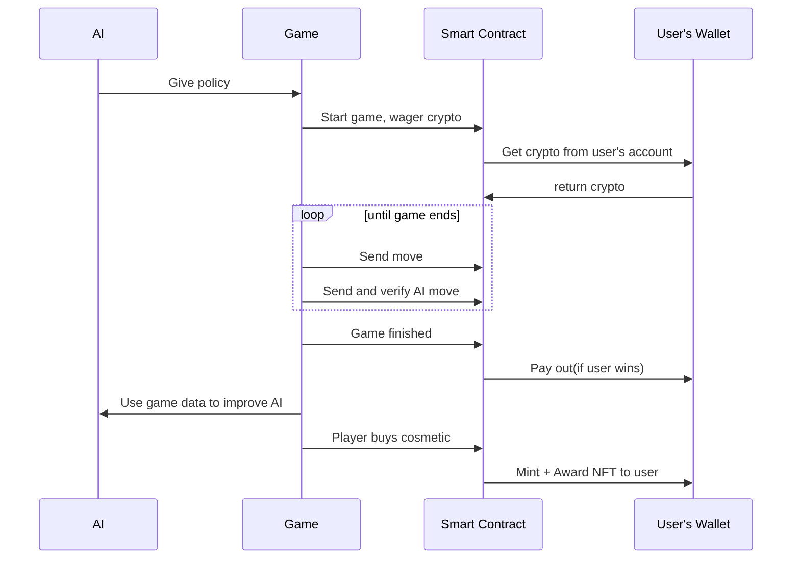
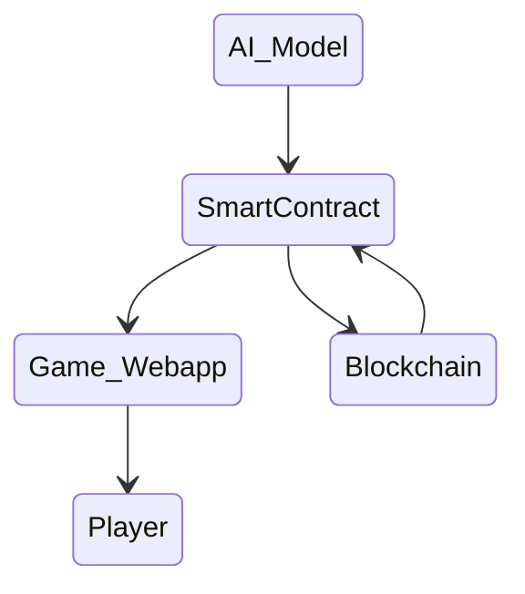

# Github Structure

"AI-Training" branch for the AI model training.

"blockchain" branch for smart contract implementation.

# CryptoCannon Showdown
[Click here to play](https://xbubonic.github.io/)
Play AI in a game of [Battleship](https://www.officialgamerules.org/battleship) (also known as Sea Battle) for the chance to win some cryptocurrency.

Users bet an amount of cryptocurrency before starting a game, and then play a game against the AI. If they win, they get their crypto back plus a bit extra. They can also purchase cosmetic NFTs to customize how the game looks, like their ships.

# Sequence Diagram

# Component Disagram

