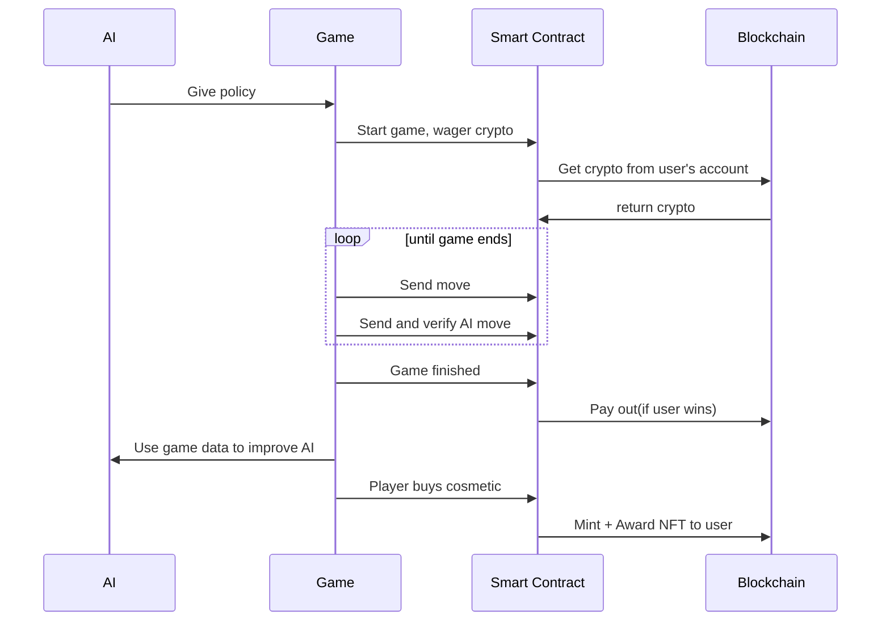

# CryptoCannon Showdown

Play AI in a game of [Battleship](https://www.officialgamerules.org/battleship) (also known as Sea Battle) for the chance to win some cryptocurrency.

```mermaid
sequenceDiagram
    Participant AI
    Participant Game
    Participant Smart Contract
    Participant Blockchain
    AI->>Game: Give policy
    Game->>Smart Contract: Start game, wager crypto
    Smart Contract->>Blockchain: Get crypto from user's account
    Blockchain->>Smart Contract: return crypto
    loop until game ends
        Game->>Smart Contract: Send move
        Game->>Smart Contract: Send and verify AI move
    end
    Game->>Smart Contract: Game finished
    Smart Contract->>Blockchain: Pay out(if user wins)
    Game->>AI: Use game data to improve AI
    Game->>Smart Contract: Player buys cosmetic
    Smart Contract->>Blockchain: Mint + Award NFT to user
```
